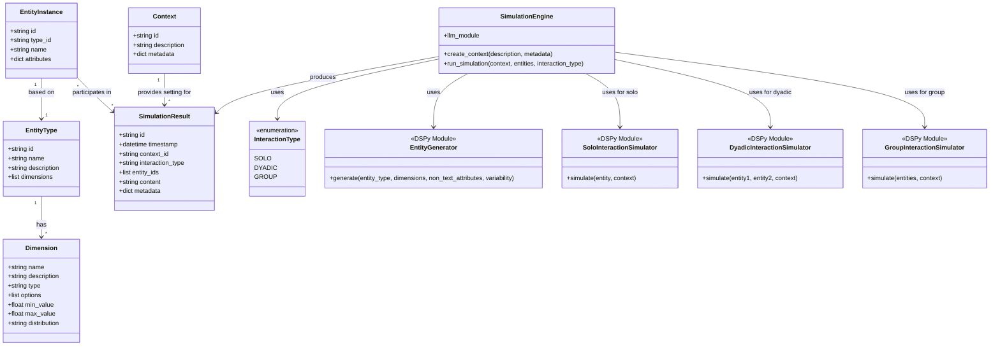

```mermaid
classDiagram
    class Dimension {
        +string name
        +string description
        +string type
        +list options
        +float min_value
        +float max_value
        +string distribution
    }
    
    class EntityType {
        +string id
        +string name
        +string description
        +list dimensions
    }
    
    class EntityInstance {
        +string id
        +string type_id
        +string name
        +dict attributes
    }
    
    class Context {
        +string id
        +string description
        +dict metadata
    }
    
    class InteractionType {
        <<enumeration>>
        SOLO
        DYADIC
        GROUP
    }
    
    class SimulationResult {
        +string id
        +datetime timestamp
        +string context_id
        +string interaction_type
        +list entity_ids
        +string content
        +dict metadata
    }
    
    class SimulationEngine {
        +llm_module
        +create_context(description, metadata)
        +run_simulation(context, entities, interaction_type)
    }
    
    class EntityGenerator {
        <<DSPy Module>>
        +generate(entity_type, dimensions, non_text_attributes, variability)
    }
    
    class SoloInteractionSimulator {
        <<DSPy Module>>
        +simulate(entity, context)
    }
    
    class DyadicInteractionSimulator {
        <<DSPy Module>>
        +simulate(entity1, entity2, context)
    }
    
    class GroupInteractionSimulator {
        <<DSPy Module>>
        +simulate(entities, context)
    }
    
    EntityType "1" --> "*" Dimension : has
    EntityInstance "1" --> "1" EntityType : based on
    EntityInstance "*" --> "*" SimulationResult : participates in
    Context "1" --> "*" SimulationResult : provides setting for
    SimulationEngine --> SimulationResult : produces
    SimulationEngine --> InteractionType : uses
    
    SimulationEngine --> EntityGenerator : uses
    SimulationEngine --> SoloInteractionSimulator : uses for solo
    SimulationEngine --> DyadicInteractionSimulator : uses for dyadic
    SimulationEngine --> GroupInteractionSimulator : uses for group
``` 