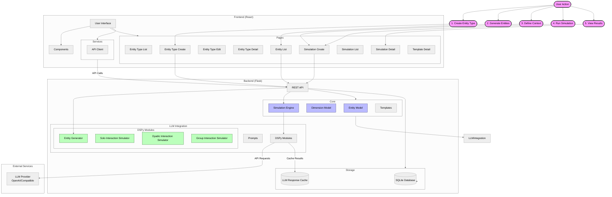

```mermaid
%%{init: {'theme': 'neutral'}}%%

graph TB
    subgraph "Frontend (React)"
        UI[User Interface]
        UI --> Pages[Pages]
        UI --> Components[Components]
        UI --> Services[API Services]
        
        subgraph "Pages"
            EntityTypeList[Entity Type List]
            EntityTypeCreate[Entity Type Create]
            EntityTypeEdit[Entity Type Edit]
            EntityTypeDetail[Entity Type Detail]
            EntityList[Entity List]
            SimulationCreate[Simulation Create]
            SimulationList[Simulation List]
            SimulationDetail[Simulation Detail]
            TemplateDetail[Template Detail]
        end
        
        subgraph "Services"
            APIClient[API Client]
        end
    end
    
    subgraph "Backend (Flask)"
        API[REST API]
        Storage[Storage Layer]
        
        subgraph "Core"
            EntityModel[Entity Model]
            DimensionModel[Dimension Model]
            SimulationEngine[Simulation Engine]
            Templates[Templates]
        end
        
        subgraph "LLM Integration"
            DSPyModules[DSPy Modules]
            Prompts[Prompts]
            
            subgraph "DSPy Modules"
                EntityGenerator[Entity Generator]
                SoloSimulator[Solo Interaction Simulator]
                DyadicSimulator[Dyadic Interaction Simulator]
                GroupSimulator[Group Interaction Simulator]
            end
        end
    end
    
    subgraph "Storage"
        Database[(SQLite Database)]
        Cache[(LLM Response Cache)]
    end
    
    subgraph "External Services"
        LLMProvider[LLM Provider\nOpenAI/Compatible]
    end
    
    %% Frontend to Backend connections
    Services --API Calls--> API
    
    %% Backend internal connections
    API --> Core
    API --> Storage
    Core --> LLMIntegration
    Storage --> Database
    
    %% LLM connections
    DSPyModules --API Requests--> LLMProvider
    DSPyModules --Cache Results--> Cache
    
    %% Data Flow
    classDef flowClass fill:#f9f,stroke:#333,stroke-width:2px;
    
    %% Flow annotations
    UserAction([User Action]):::flowClass
    CreateEntityType([1. Create Entity Type]):::flowClass
    GenerateEntities([2. Generate Entities]):::flowClass
    DefineContext([3. Define Context]):::flowClass
    RunSimulation([4. Run Simulation]):::flowClass
    ViewResults([5. View Results]):::flowClass
    
    UserAction --> CreateEntityType
    CreateEntityType --> EntityTypeCreate
    EntityTypeCreate --> API
    
    UserAction --> GenerateEntities
    GenerateEntities --> EntityList
    EntityList --> API
    API --> EntityGenerator
    
    UserAction --> DefineContext
    DefineContext --> SimulationCreate
    
    UserAction --> RunSimulation
    RunSimulation --> SimulationCreate
    SimulationCreate --> API
    API --> SimulationEngine
    SimulationEngine --> DSPyModules
    
    UserAction --> ViewResults
    ViewResults --> SimulationDetail
    
    %% Class models
    classDef modelClass fill:#bbf,stroke:#336,stroke-width:1px;
    class EntityModel,DimensionModel,SimulationEngine modelClass;
    
    %% DSPy modules
    classDef dspyClass fill:#bfb,stroke:#363,stroke-width:1px;
    class EntityGenerator,SoloSimulator,DyadicSimulator,GroupSimulator dspyClass;
``` 