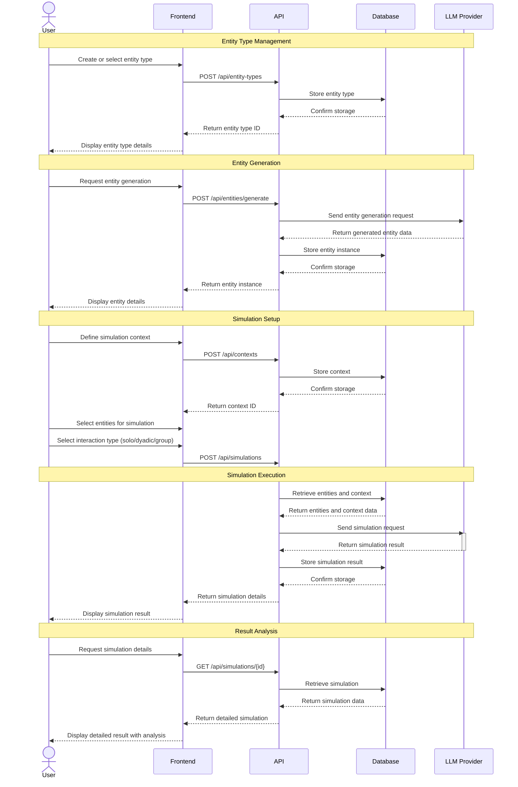

```mermaid
sequenceDiagram
    actor User
    participant Frontend
    participant API
    participant DB as Database
    participant LLM as LLM Provider
    
    Note over User,LLM: Entity Type Management
    
    User->>Frontend: Create or select entity type
    Frontend->>API: POST /api/entity-types
    API->>DB: Store entity type
    DB-->>API: Confirm storage
    API-->>Frontend: Return entity type ID
    Frontend-->>User: Display entity type details
    
    Note over User,LLM: Entity Generation
    
    User->>Frontend: Request entity generation
    Frontend->>API: POST /api/entities/generate
    API->>LLM: Send entity generation request
    LLM-->>API: Return generated entity data
    API->>DB: Store entity instance
    DB-->>API: Confirm storage
    API-->>Frontend: Return entity instance
    Frontend-->>User: Display entity details
    
    Note over User,LLM: Simulation Setup
    
    User->>Frontend: Define simulation context
    Frontend->>API: POST /api/contexts
    API->>DB: Store context
    DB-->>API: Confirm storage
    API-->>Frontend: Return context ID
    
    User->>Frontend: Select entities for simulation
    User->>Frontend: Select interaction type (solo/dyadic/group)
    Frontend->>API: POST /api/simulations
    
    Note over User,LLM: Simulation Execution
    
    API->>DB: Retrieve entities and context
    DB-->>API: Return entities and context data
    API->>LLM: Send simulation request
    activate LLM
    LLM-->>API: Return simulation result
    deactivate LLM
    API->>DB: Store simulation result
    DB-->>API: Confirm storage
    API-->>Frontend: Return simulation details
    Frontend-->>User: Display simulation result
    
    Note over User,LLM: Result Analysis
    
    User->>Frontend: Request simulation details
    Frontend->>API: GET /api/simulations/{id}
    API->>DB: Retrieve simulation
    DB-->>API: Return simulation data
    API-->>Frontend: Return detailed simulation
    Frontend-->>User: Display detailed result with analysis
``` 